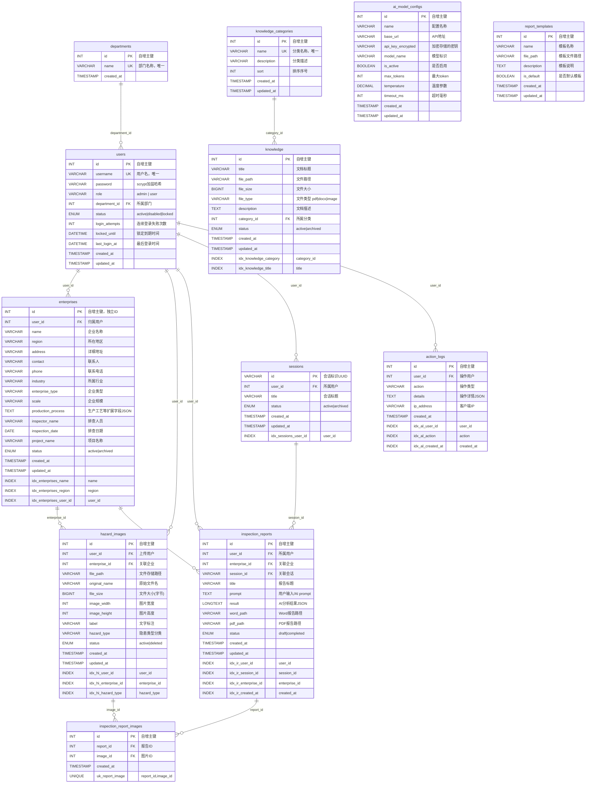

# 安全生产社会化服务智检系统 — 数据库 E-R 图

> 优化版本，覆盖立项书 8 大核心模块。

## 优化清单（对比旧版）

### 新增表（6 张）
| 表名 | 解决哪个立项书需求 |
|------|-------------------|
| `departments` | 用户需填写"所属部门" |
| `sessions` | 会话持久化，服务器重启不丢失 |
| `inspection_report_images` | 解决多图分析结果与图片的多对多关联 |
| `ai_model_configs` | 对接多模型、管理员动态切换 |
| `report_templates` | 报告格式标准化 |

### 字段增强（关键变更）
| 表 | 新增字段 | 原因 |
|----|---------|------|
| users | `status`, `login_attempts`, `locked_until`, `last_login_at` | 账户安全锁定、操作留痕 |
| users | `department_id` FK | 立项书要求 |
| users | `username` UNIQUE | 防止重复注册 |
| enterprises | 独立 `id` PK | 一个用户可排查多家企业 |
| enterprises | `industry`, `enterprise_type`, `scale`, `inspector_name`, `inspection_date` | 立项书表单字段 |
| hazard_images | `enterprise_id` FK | 图片与企业自动关联 |
| hazard_images | `hazard_type`, `image_width`, `image_height` | 按隐患类型分类、前端展示 |
| inspection_reports | `enterprise_id` FK, `title`, `status` | 报告与企业直接关联、按状态管理 |
| knowledge | `file_size`, `file_type`, `status` | 文件管理完整性 |
| action_logs | `ip_address` | 安全审计 |
