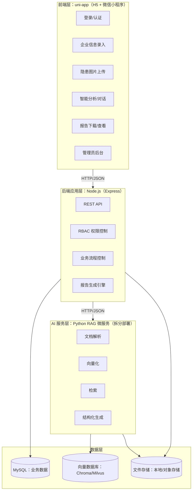

# 智检系统（安全生产社会化服务智检系统）设计文档

## 1. 目标与范围

- **目标**：实现企业安全隐患“采集 → 分析 → 报告生成 → 留痕可追溯”的闭环流程，支持 H5 与微信小程序双端使用，并满足软著/项目书对架构分层与模块划分的要求。
- **使用范围**：公司内部使用，暂不对外运营。
- **核心角色**：系统管理员、普通用户（检查员/成员）。

## 2. 总体架构（四层）

系统采用四层解耦架构，前后端完全分离，AI RAG 以微服务形式拆分：



## 3. 分层职责与边界

### 3.1 前端层（uni-app）

- **职责**：用户交互、表单校验、文件选择与上传、消息展示、报告下载/预览。
- **不负责**：权限判定最终结果（前端仅做 UI 控制，最终以后端 RBAC 为准）、任何数据库/向量检索逻辑。
- **关键页面**：
  - 登录/注册、服务器设置（开发联调）
  - 普通用户：企业信息录入、隐患上传、智能分析、报告查看/下载
  - 管理员：用户管理、知识库管理、操作日志、模型配置

### 3.2 后端应用层（Node.js / Express）

- **职责**：
  - **RBAC 权限控制**：对管理员接口实施强制鉴权；普通用户接口按用户身份隔离数据。
  - **业务流程控制**：会话管理、隐患分析任务编排、日志留痕、错误统一处理。
  - **报告生成引擎**：将 AI 结果与图片等素材生成 Word/PDF，可复用模板能力（后续扩展）。
  - **AI 调度**：统一对接大模型与 RAG 微服务，屏蔽底层差异。
- **不负责**：解析/向量化/检索的具体实现（下沉至 Python RAG 微服务）。

### 3.3 AI 服务层（Python RAG 微服务，强烈建议拆分）

- **拆分理由**：
  - 文档解析与向量化 CPU/内存占用高，适合独立弹性扩缩容
  - 便于引入 Python 生态（unstructured、pdfplumber、pymilvus、chromadb、langchain 等）
  - 与 Node 业务层解耦，避免业务服务被长耗时任务拖垮
- **职责**：
  - 文档解析：PDF/Word/图片 OCR（可选）→ 结构化文本块
  - 向量化：chunk → embedding → 写入向量库
  - 检索：query → embedding → topK → rerank（可选）→ 返回证据片段
  - 结构化生成：将证据片段 + 业务约束 → 输出结构化 JSON（便于报告模板落地）

### 3.4 数据层（MySQL + 向量库 + 文件存储）

- **MySQL（业务数据）**：用户、角色、权限、企业信息、会话与历史、日志、系统配置等。
- **向量数据库（Chroma/Milvus）**：
  - Chroma：开发/小规模部署更轻量
  - Milvus：数据量大、需要高可用/更强检索能力时使用
- **文件存储（本地/对象存储）**：
  - 本地：开发与内网部署
  - 对象存储：生产建议（版本管理、权限隔离、备份更方便）

## 4. 权限模型（RBAC）

- **系统管理员**：
  - 用户管理（创建/编辑/删除/重置密码）
  - 知识库管理（上传/更新/删除/分类/标签）
  - 模型配置（选择模型、密钥配置、限流策略）
  - 操作日志与全量数据查看
- **普通用户**：
  - 企业信息录入与编辑
  - 隐患图片上传与分析
  - 报告生成与下载
  - 仅可查看自身记录与报告

## 5. 关键业务流程

### 5.1 隐患分析与报告生成

1. 前端提交：文字描述 +（可选）图片/附件 + 会话标识
2. Node 校验参数 → 记录请求日志 → 调用 AI：
   - 需要检索：Node 调用 RAG `/rag/retrieve` 获取证据片段
   - Node 将证据片段 + 用户输入 → 调用大模型生成分析结果（结构化优先）
3. Node 调用报告生成引擎：按模板生成 Word/PDF → 写入文件存储
4. Node 写入 MySQL：会话/历史/文件路径/企业信息关联
5. 前端展示结果并提供下载

### 5.2 知识库入库（管理员）

1. 管理端上传文件（PDF/Word/图片）→ Node 接收并写入文件存储
2. Node 调用 RAG `/rag/ingest`：解析 → 分块 → 向量化 → 写入向量库
3. Node 写入 MySQL：知识库条目元数据（标题、描述、标签、文件路径、状态）
4. 管理端可更新/删除：同步更新 MySQL，并通知 RAG 删除向量（可异步）

## 6. 接口规范（统一返回）

为满足“统一返回格式、统一异常处理”的项目要求，推荐标准返回：

```json
{ "code": 0, "msg": "ok", "data": {} }
```

- `code`：0 表示成功，其它为错误码
- `msg`：可读错误信息
- `data`：业务数据

说明：当前实现中部分接口仍使用 `{ success, message, data }`，后续逐步迁移到上述标准格式，并保持兼容解析能力。

## 7. Python RAG 微服务对接（建议接口）

### 7.1 入库接口（解析 + 向量化）

- `POST /rag/ingest`
- 入参（JSON）：
  - `docId`：文档唯一标识（与 MySQL knowledge.id 对齐）
  - `fileUrl`：文件可访问地址（对象存储 URL 或后端下载地址）
  - `meta`：标签、分类、来源等
- 出参（JSON）：
  - `chunks`：入库分块数量
  - `embeddingModel`：向量模型标识

### 7.2 检索接口（向量检索）

- `POST /rag/retrieve`
- 入参（JSON）：
  - `query`：用户问题
  - `topK`：返回数量
  - `filters`：标签/分类过滤（可选）
- 出参（JSON）：
  - `items[]`：证据片段列表（`text、score、source、page、docId` 等）

### 7.3 结构化生成接口（可选）

- `POST /rag/structured-generate`
- 入参：`query + evidenceItems + schema`
- 出参：符合 schema 的结构化 JSON（用于报告模板字段填充）

## 8. 部署建议（dev/test/prod）

- **开发（dev）**：
  - Node + MySQL +（可选）Chroma 本地容器
  - 前端 H5 通过 Vite 代理访问 Node
- **测试（test）**：
  - Node 与 RAG 服务拆分，便于压测与容量评估
  - 向量库可切换至 Milvus（如需）
- **生产（prod）**：
  - Node 与 RAG 独立部署 + Nginx 反向代理
  - 文件存储优先对象存储；MySQL/向量库做好备份与监控
  - 权限最小化、端口限制、防火墙与日志持久化

## 9. 功能模块与需求映射（项目书对齐）

### 9.1 用户登录与权限管理模块

- 登录方式：账号密码登录。
- 权限模型：RBAC（系统管理员/普通用户），以**后端鉴权为准**，前端仅做 UI 收敛。
- 账户创建策略：普通用户可注册；管理员账号建议由初始化或管理员端创建，避免越权。
- 操作留痕：登录、创建/修改/删除等关键行为写入操作日志，可追溯。

### 9.2 企业基本信息管理模块（普通用户）

- 信息录入：企业名称、所在地区、详细地址、联系人、联系电话等。
- 信息编辑与保存：支持已录入信息的修改并自动保存最新数据。
- 数据关联：企业信息与隐患图片、分析结果、报告记录建立关联，形成企业档案。

### 9.3 知识库管理模块（管理员）

- 本地知识库部署：支持上传 Word/PDF/图片等标准规范文档。
- 知识库维护：支持编辑、删除、更新文件、分类管理与分类选择（支持预置分类与自定义新增）。
- 知识库检索：供 RAG 检索作为隐患分析依据，并可回溯引用来源（规划）。

### 9.4 大模型对接与调度模块

- 模型对接：支持对接多家模型（如 DeepSeek、豆包、千问等），并统一抽象“模型选择/密钥/参数”。
- 调用触发：用户上传隐患图片并提交分析请求后触发；输入可包含“企业信息 + 图片 + 知识库检索结果”。
- 异常处理：网络错误、超时、接口失败等需有明确提示，并支持重试。

### 9.5 隐患图片上传与处理模块

- 图片上传：支持单张/多张上传，常见格式（JPG/PNG/BMP）。
- 上传反馈：显示进度条或 loading，失败提示原因并支持重试。
- 图片预处理（规划）：压缩、旋转纠正、裁剪等，以提升展示效果并减少存储占用。
- 图片管理（规划）：查看、删除、替换；删除图片时需提示对关联分析/报告的影响。

### 9.6 智能隐患分析模块

- 分析触发：企业信息录入 + 隐患图片上传/选择后，点击“发送”触发智能分析流程；分析过程中支持点击“停止”手动中断请求（类豆包交互）。
- 输出内容（建议结构化）：隐患描述、排查依据（法规/标准条款）、整改建议；支持多图一次分析，返回 `items[]`（每张图片对应一条结构化结果）。
- 结果编辑与保存：AI 结果支持用户手动补充/修改，并保存为最终版本用于报告生成与下载。

### 9.7 报告生成与下载模块

- 报告格式：Word（`.docx`）为主，支持后续编辑修改；可选生成 PDF 便于预览。
- 内容自动填充：企业信息、隐患分析结果、图片等按模板填充。
- 报告预览：在对话与历史记录中支持直接下载/打开 Word/PDF 报告文件。
- 报告管理：支持在历史记录中按时间查看、下载与删除报告记录；编辑保存后自动重生成 Word/PDF。

### 9.8 数据存储与查询模块（MySQL）

- 数据存储：用户信息、企业信息、隐患图片、知识库、分析结果、报告文件、操作记录等。
- 数据查询：支持多维度筛选与排序（企业名称、隐患类型、日期范围等）。
- 数据导出（规划）：企业列表/分析结果导出 Excel；报告文件保持 Word 格式下载。
- 数据备份（规划）：手动/自动备份，支持周期设置（每日/每周）。

## 10. 多端运行（网页端 + 微信小程序）

### 10.1 运行与部署原则

- 同一套前端代码：uni-app 同时编译 H5 与微信小程序。
- 同一套后端服务：Node/Express 提供统一 REST API，前端通过标准化 API 交互。
- 环境差异收敛：H5 与小程序在网络、文件、组件能力上不同，需使用条件编译或适配层屏蔽差异。

### 10.2 H5（网页端）

- 开发：通过 Vite 代理访问后端，避免跨域；页面请求使用 `/api` 相对路径。
- 生产：建议使用 Nginx 反向代理统一转发 `/api` 与 `/uploads` 到后端服务；静态资源由 Nginx 托管。

### 10.3 微信小程序

- 开发联调：可通过局域网 IP 访问后端（同一 Wi-Fi），并提供“服务器设置”用于切换地址。
- 真机/上线：需使用 HTTPS 域名并在微信公众平台配置 request/downloadFile 合法域名；内网 IP/HTTP 会被限制。

### 10.4 组件能力差异处理

- 地区选择：小程序可使用系统级滑动地区选择；H5 若不支持则提供可用替代方案（例如输入/自定义选择器），保持“两个端都可用”。
- 文件上传/下载：H5 与小程序的文件系统能力不同，需分别适配（H5 使用浏览器下载，小程序使用 `downloadFile/openDocument`）。

## 11. 技术与安全要求（项目书对齐）

### 11.1 性能要求

- 图片上传、AI 分析、报告生成等核心流程应提供明确的加载反馈，并避免无响应。
- 核心接口需限制超时并支持重试，避免用户端长时间卡顿。

### 11.2 安全要求

- 密码安全：密码不得明文存储，需使用加盐哈希；敏感信息不写入日志。
- 访问安全：管理员接口必须鉴权，普通用户数据必须隔离。
- 操作安全：删除、修改等高危操作需二次确认；关键行为必须写入操作日志。
- 数据安全（规划）：敏感数据传输加密（HTTPS），重要数据支持备份与恢复。

## 12. 交付与验收标准（项目书对齐）

- **功能完整性**：登录/权限、企业信息、图片上传、智能分析、报告生成与下载、知识库管理等核心模块可用。
- **多端可运行**：网页端（H5）与微信小程序端均可正常登录与使用核心流程。
- **稳定性**：连续操作无明显崩溃、卡顿、闪退；失败场景提示明确并可恢复。
- **数据正确性**：分析结果与报告内容与输入企业信息、图片、知识库依据一致，可追溯。
- **文档完整性**：设计文档、接口文档、操作手册/测试报告/部署维护说明（规划补齐）满足项目书要求。
